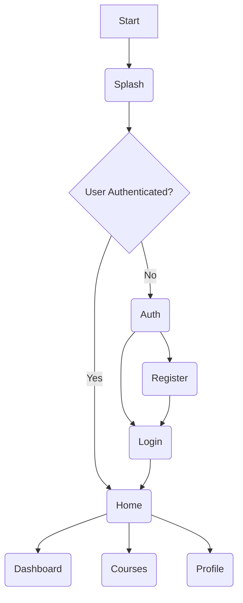

```mermaid
graph TD
    A[Start] --> B(Splash)
    B --> C{User Authenticated?}
    C -->|No| D(Auth)
    C -->|Yes| E(Home)

    D --> D1(Login)
    D --> D2(Register)
    D1 --> E
    D2 --> D1

    E --> E1(Dashboard)
    E --> E2(Courses)
    E --> E3(Profile)
```
